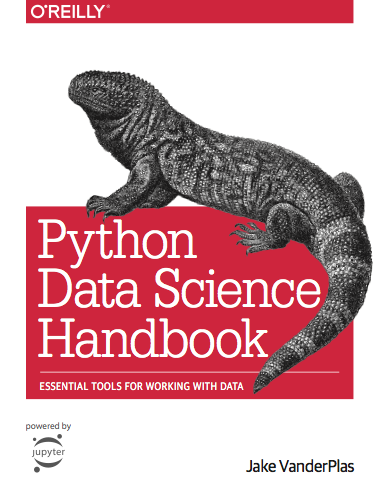

```{r setup, include=FALSE}
library(knitr)
options(htmltools.dir.version = FALSE)
opts_chunk$set(
  warning = FALSE,
  message = FALSE,
  echo = FALSE,
  cache.path = 'cache/',
  fig.align = 'center',
  cache = FALSE
)
library(anicon)

```

class: inverse, middle, center

# Who we are?
---
class: center

# Who we are?

.pull-left[

```{r   out.width = "90%", echo = FALSE, fig.cap=''}


```

Thiyanga S. Talagala

```{r}
icon::fa("globe")
```
thiyanga.netlify.app

```{r}
icon::fa("github")
icon::fa("twitter")

```
thiyangt

].pull-right[

```{r   out.width = "90%", echo = FALSE, fig.cap='' }

```

Priyanga D. Talagala

```{r}

icon::fa("globe")
```
prital.netlify.app

```{r}
icon::fa("github")
icon::fa("twitter")

```
pridiltal
]

---

class: inverse, middle, center

# Why Learn R?
```{r   out.width = "30%", echo = FALSE, fig.cap=''}
knitr::include_graphics("fig/Rlogo.png")

```
---
.pull-left[
#### `DSjobtracker` R Package (on CRAN, 2020)
<font size="2">by Statistical Consultancy Service, <br/>
University of Sri Jayewardenepura, 2020
https://thiyangt.github.io/DSjobtracker/
 </font>
]
.pull-right[
```{r   out.width = "40%", echo = FALSE}
knitr::include_graphics("fig/DSjobtrackerhexsticker.png")
```
]

#### Top twenty skills required for data science jobs

```{r out.width = "55%"}
library(DSjobtracker)
library(tidyr)
library(magrittr)
library(dplyr)
library(ggplot2)
library(viridis)
library(forcats)

theme_set(theme_minimal())

skills_long <- DStidy %>%
  select(c(R:Bahasa_Malaysia)) %>%
  pivot_longer(c(R:Bahasa_Malaysia), values_to = "Value", names_to = "Name") %>%
  mutate(Value = as.numeric(levels(Value))[Value]) %>%
  group_by(Name) %>%
  summarize(Total = sum(Value)) %>%
  arrange(Total)

p<- skills_long %>%
  mutate(Name = factor(Name, levels = .$Name)) %>%
  top_n(20) %>%
  ggplot(aes(x = Name, y = Total)) +
  geom_bar(stat = "identity") +
  geom_label(aes(label = Total),
    nudge_y = -10, size = 5,
    label.padding = unit(0.125, "lines")
  ) +
  coord_flip() +
  labs(
    x = "Skill Required", y = "No of job vacancies"
  )+
  theme(text = element_text(size=20))

print (p)
```

---


class: inverse, middle, center

# R Vs Python 

---
class: inverse, middle, center


# ~~R Vs Python~~

# R AND Python 
--

```{r out.width = "50%"}
library(tibble)
library(tidyverse)
skills <- c("R and Python", "Python only", "Other Statistical SW", "R, SAS & Python only", "SAS only" )
count <- c(124,91,67,26,13)
data <- tibble(skills, count)


p<- data %>%
  ggplot(aes(x = reorder(skills, count) , y = count)) +
  geom_bar(stat = "identity") +
  geom_label(aes(label = count),
    nudge_y = -10, size = 5,
    label.padding = unit(0.125, "lines")
  ) +
  coord_flip() +
  labs(
    x = "Skill Required", y = "No of  advertisements"
  )+
  theme(text = element_text(size=20))
print(p)
```
---
class: inverse, middle, center


# ~~R Vs Python~~

# R AND Python 

#  <span style="color:SkyBlue">Stay</span> <span style="color:orange">TUNED !!</span> 

```{r   out.width = "15%", echo = FALSE, fig.cap=''}
knitr::include_graphics("fig/Rlogo.png")

```

# +
```{r   out.width = "25%", echo = FALSE, fig.cap=''}
knitr::include_graphics("fig/python.png")

```

---
class: inverse, middle, center
# Main Organizer
## R-Ladies Global 
```{r   out.width = "30%", echo = FALSE, fig.cap=''}
knitr::include_graphics("fig/globalhexSticker.png")

```

```{r}

icon::fa("globe")
```
https://rladies.org/

```{r}
icon::fa("twitter")
```
RLadiesGlobal

---
background-image:url('fig/talks.jpg')
background-position: 60% 100%
background-size: 100%
class: top, center

.pull-left[
## R-Ladies Global 
### <span style="color:black"> 197 Chapters</span>

### <span style="color:black"> 80476 Members </span>

### <span style="color:black"> 56 Countries</span>
]
.pull-right[
```{r   out.width = "100%", echo = FALSE, fig.cap=''}


```
<font size="2"> Source: https://benubah.github.io/r-community-explorer/rladies.html</font>
]

---
class:  middle, center

# Why RLadies Colombo?
```{r   out.width = "80%", echo = FALSE, fig.cap='R-Ladies Across Regions'}


```
<font size="2"> Source: https://benubah.github.io/r-community-explorer/rladies.html</font>
---
background-image:url('fig/RLcol.png')
background-position: 50% 90%
background-size: 100%
class: top, left, inverse

.pull-left[
# R-Ladies Colombo
]
.pull-right[
```{r}

icon::fa("globe")
```
rladiescolombo.netlify.app

```{r}
icon::fa("twitter")
```
RLadiesColombo

```{r}
icon::fa("meetup")
```
www.meetup.com/rladies-colombo/
]
---
class: inverse, center, middle
# Code of conduct

R-Ladies is dedicated to providing a harassment-free experience for **EVERYONE**

To ensure a **safe, enjoyable**, and **friendly** experience for everyone who participates, we follow the [R-Ladies International Code of Conduct](https://github.com/rladies/starter-kit/wiki/Code-of-Conduct) 

This code of conduct applies to all R-Ladies spaces, including meetups, Twitter, Slack, mailing lists, both online and offline.
---
background-image:url('fig/tidyworkflow1.png')
background-position: 60% 80%
background-size: 100%
class: top, center
# Tidy Workflow
---
background-image:url('fig/tidyworkflow2.png')
background-position: 60% 80%
background-size: 100%
class: top, center

# Tidy Workflow


---
class: inverse, middle, center

```{r}
icon::fa("twitter")
```
<blockquote class="twitter-tweet"><p lang="en" dir="ltr">I haven’t even heard of latex or markdown, makes me feel a tad old 😢</p>&mdash; Oscar Jonsson (@OAJonsson) <a href="https://twitter.com/OAJonsson/status/1162473463174635520?ref_src=twsrc%5Etfw">August 16, 2019</a></blockquote> <script async src="https://platform.twitter.com/widgets.js" charset="utf-8"></script>


---
class: inverse, middle, center

```{r}
icon::fa("twitter")
```

.pull-left[

<blockquote class="twitter-tweet"><p lang="en" dir="ltr">I also wrote my recent <a href="https://twitter.com/OReillyMedia?ref_src=twsrc%5Etfw">@OReillyMedia</a> book in Jupyter notebooks: <a href="https://t.co/YOvGLm9dxu">https://t.co/YOvGLm9dxu</a><br><br>I wouldn&#39;t say it&#39;s the best option for &quot;formal&quot; publishing—I&#39;d prefer something closer to rmarkdown / bookdown—but Jupyter certainly worked well enough for me!</p>&mdash; Jake VanderPlas (@jakevdp) <a href="https://twitter.com/jakevdp/status/948943224390889473?ref_src=twsrc%5Etfw">January 4, 2018</a></blockquote> <script async src="https://platform.twitter.com/widgets.js" charset="utf-8"></script>
] .pull-right[
```{r   out.width = "100%", echo = FALSE, fig.cap=''}

```
]
---
class: inverse, middle, center

```{r}
icon::fa("twitter")
```
<blockquote class="twitter-tweet"><p lang="en" dir="ltr">Plus you can mix up multiple languages in single Rmd if you need to. I don&#39;t think that is possible with Jupyter. You can even exchange data between python and R using the reticulate package.</p>&mdash; Jerry Thomas (@jerrythomas_in) <a href="https://twitter.com/jerrythomas_in/status/1030691102624382976?ref_src=twsrc%5Etfw">August 18, 2018</a></blockquote> <script async src="https://platform.twitter.com/widgets.js" charset="utf-8"></script>
---
class: inverse, middle center

# Buckle Up!


```{r   out.width = "23%", echo = FALSE, fig.cap=''}
knitr::include_graphics("fig/rmarkdown.png")
```
--

# ON YOUR MARKS, GET SET, GO!!
---
class: inverse, middle, center

```{r}
icon::fa("twitter")
```
<blockquote class="twitter-tweet"><p lang="en" dir="ltr">I haven’t even heard of latex or markdown, makes me feel a tad old 😢</p>&mdash; Oscar Jonsson (@OAJonsson) <a href="https://twitter.com/OAJonsson/status/1162473463174635520?ref_src=twsrc%5Etfw">August 16, 2019</a></blockquote> <script async src="https://platform.twitter.com/widgets.js" charset="utf-8"></script>


---
class: inverse, middle, center

# Next `r icon::fa("meetup")`

`r anicon::faa("bell", animate="ring", size =4, speed = "fast")`
--


## <span style="color:SkyBlue"> Plot a lot with ggplot2 to find plots </span>

.pull-left[


<span style="color:SkyBlue"> library(datasauRus) </span>

] 
.pull-right[
```{r   out.width = "50%", echo = FALSE, fig.cap=''}
knitr::include_graphics("fig/ggplot.png")
```

]

<font size="1"> Image source: https://github.com/stephlocke/lazyCDN/blob/master/DinoSequential.gif </font>

---

class: inverse, middle, center

# Thank you

## Acknowledgement

Statistics Society - University of Sri Jayewardenepura
